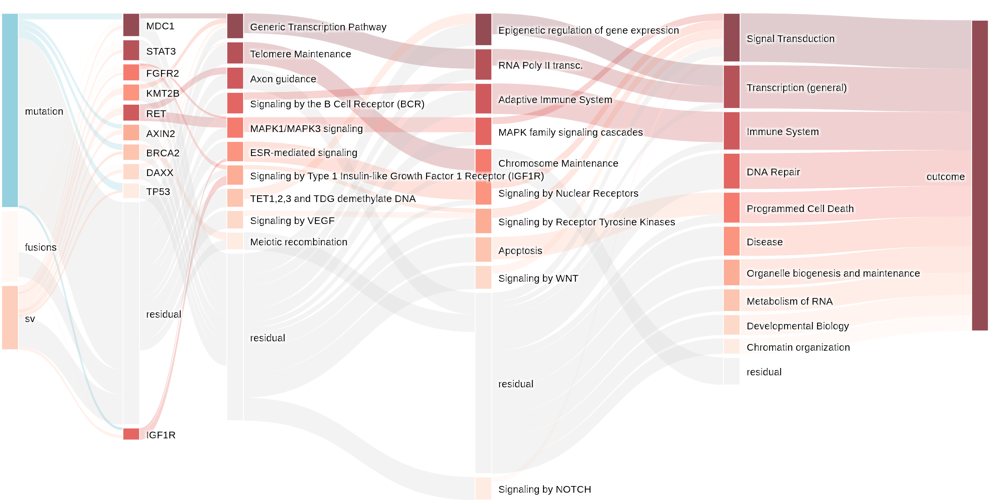
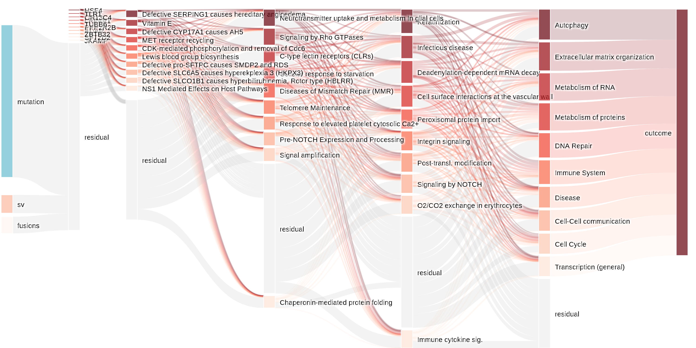
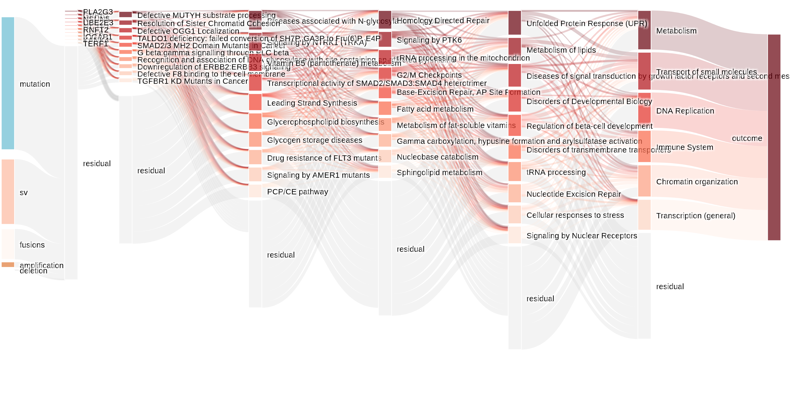

### Hi there 👋

I'm Mengqi Liu, a second-year master student in Statistics at the University of Chicago. Here I'm fortunate to work with Prof. Barber and Prof. Aragam. Prior to UChicago, I obtained my Bachelor of Science degree in Statistics at Beijing Normal Unversity.

My current research interests lie in the intersection of distribution-free inference, graphical model, causal inference and generalized machine learning.

***
**Current project about validity and power exploration for the local permutation test** 
**Supervisor**: Rina Barber 
Experimental results later... 
[**Initial Code**](https://github.com/lmqxwm/LPT) 
[**Second Version**](https://github.com/lmqxwm/LPT2) 
***
**Current project about global minimum check and possible solutions for NOTEARS** 
**Supervisor**: Bryon Aragam 
Experimental results later... 
[**Initial Code**](https://github.com/lmqxwm/Notears_) 
[**Pytorch Version**](https://github.com/lmqxwm/Notears_pytorch) 
***
**Sep 2021 - May 2022** 
Under supervision of Dr. Renjun Xu, we replicated biologially informed network, where the first layer is randomly connected and the following layers are connected according to their gene-pathway relationships. Then we collected public data for stomach, colorectal and liver cancer, and applied the model on these three datasets, with the hope to identify domain-unique and common genetic variation sites. 
***Reference**: Elmarakeby, H.A., Hwang, J., Arafeh, R. et al. Biologically informed deep neural network for prostate cancer discovery. Nature 598, 348–352 (2021).*
- Stomach cancer

- Colorectal cancer

- Liver cancer

***
**Aug 2021 - Jan 2022**  
**ExtraMAE** 🔗[paper](https://arxiv.org/abs/2201.07006)  
**Collaborators**: Mengyue Zha, SiuTim Wong, Tong Zhang, Kani Chen 
We worked on generating synthetic financial time series data for downstream tasks to compensate for financial data's expensiveness and scarcity. Here we used the supervised learning method, a masked autoencoder model, to complete time series generation and found its superiority in various downstream tasks such as time series classification, prediction, and imputation. We detailed the model and its outstanding performance comparing to other benchmark models in the paper。 
**Sources**: [ExtraMAE code](https://github.com/Dolores2333/ExtraMAE); [One benchmark C-RNN-GAN code](https://github.com/lmqxwm/C-RNN-GAN)

***
### More about me:

 - I love exploration and challenges. ♒️
 - Recent activities: ⛷🧩🏸🎹⛰🚴🏻‍♀️
 - If you would like to walk along Lake Michigan in Chicago, feel free to [reach out✉️](mqliu@uchicago.edu).
***

<!--
**lmqxwm/lmqxwm** is a ✨ _special_ ✨ repository because its `README.md` (this file) appears on your GitHub profile.

Here are some ideas to get you started:

- 🔭 I’m currently working on ...
- 🌱 I’m currently learning ...
- 👯 I’m looking to collaborate on ...
- 🤔 I’m looking for help with ...
- 💬 Ask me about ...
- 📫 How to reach me: ...
- 😄 Pronouns: ...
- ⚡ Fun fact: ...
-->
